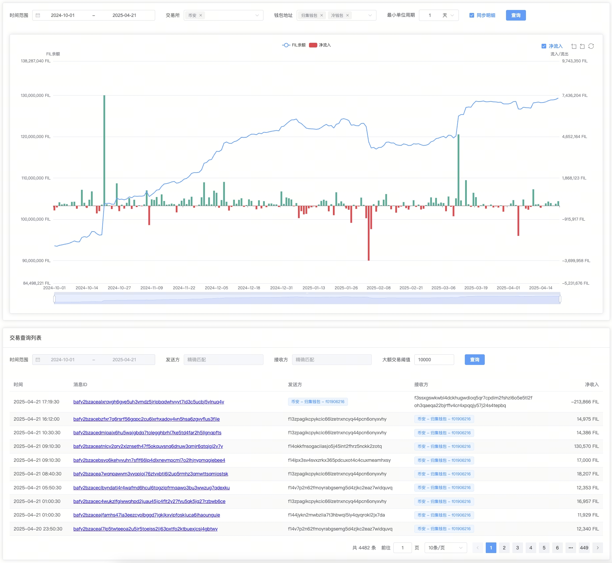

# FilTxStats

### Project Summary
This is a data monitoring dashboard for filcoin miner, which can batch monitor the balance changes, net inflows, net outflows, detailed transaction data of miner of a batch of nodes; 

key feature:
- The supported time dimension exceeds the maximum of over one year and the minimum can be detailed to one filcoin epoch. 
- It is capable of automatically accumulating and calculating the data of multiple selected nodes.
- To achieve a query speed of less than 500ms, the table data is reduced by creating database triggers shim big table, and the existing queries are accelerated by establishing caches. Two methods are used to realize the rapid calculation of data at the level of 500k rows


### Demo
 


### Data Source
Our data read from the lily database. We obtain transaction data from the messages table and balance data from the actors table


### Develop

1. Install node.js. A version larger than v16 is better.
2. Clone project
3. Create a mysql database
  ```sql
  CREATE TABLE `exchange_address` (
    `id` int(10) NOT NULL AUTO_INCREMENT COMMENT 'pk id',
    `exchange` varchar(255) NOT NULL COMMENT 'virtual currency exchange name',
    `address_name` varchar(255) NOT NULL COMMENT 'address tag name',
    `address_id` varchar(32) NOT NULL COMMENT 'address id',
    `address` varchar(128) NOT NULL COMMENT 'address',
    `type` tinyint(1) unsigned NOT NULL DEFAULT '1' COMMENT 'wallet type 1=>collect wallet；2=>cold wallet',
    `created_at` datetime NOT NULL DEFAULT CURRENT_TIMESTAMP,
    `updated_at` datetime NOT NULL DEFAULT CURRENT_TIMESTAMP ON UPDATE CURRENT_TIMESTAMP,
    `deleted_at` datetime DEFAULT NULL,
    PRIMARY KEY (`id`) USING BTREE,
    UNIQUE KEY `idx_address_id` (`address_id`) USING BTREE,
    KEY `idx_address` (`address`(32)) USING BTREE
  ) ENGINE=InnoDB AUTO_INCREMENT=4 DEFAULT CHARSET=utf8 COMMENT='Virtual currency exchange address';

  CREATE TABLE `global_config` (
  `id` int(11) unsigned NOT NULL AUTO_INCREMENT,
  `name` varchar(32) NOT NULL COMMENT 'config name',
  `value` varchar(255) NOT NULL DEFAULT '' COMMENT 'config value',
  PRIMARY KEY (`id`)
) ENGINE=InnoDB AUTO_INCREMENT=2 DEFAULT CHARSET=utf8 COMMENT='global config';

  ```
4. Search for or build a lily data sources by yourself
5. Create a .env config in location:  apps/lily-schedule/.env
  ```properties
  REAL_ENV='local'

  # mysql
  DATABASE_HOST='mysql host'
  DATABASE_PORT=3306
  DATABASE_USERNAME=''
  DATABASE_PASSWORD=''
  DATABASE_DATABASE=''

  # lily
  PG_DATABASE_HOST='lily host'
  PG_DATABASE_PORT=5432
  PG_DATABASE_USERNAME=''
  PG_DATABASE_PASSWORD=''
  PG_DATABASE_DATABASE=''


  # redis
  REDIS_CLIENT_PORT=6379
  REDIS_CLIENT_HOST='127.0.0.1'
  REDIS_CLIENT_PASSWORD=''
  REDIS_CLIENT_DB=0

  # lark robot url
  LARK_TO_BRUCE_URL=''
  ```
6. Go to apps/lily-schedule and run this project
  ```shell
  npm run dev
  ```

### Deploy

run docker build in app root directory

```shell

docker build -f ./apps/lily-schedule/DockerFile -t filtxstats:1.0.0 .

```